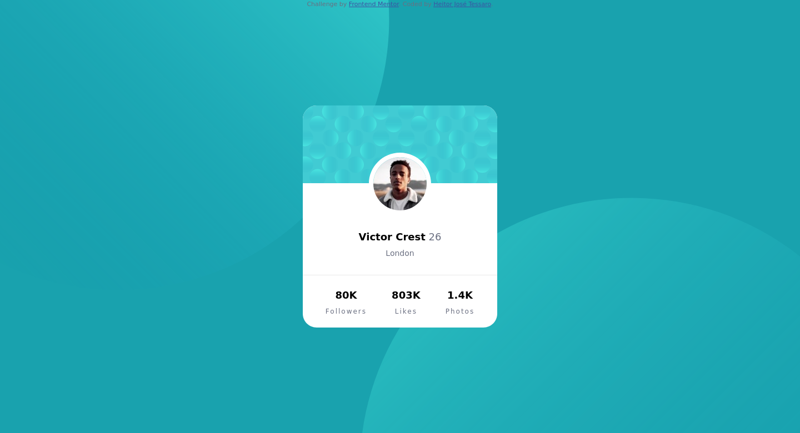

# Frontend Mentor - Profile card component solution

This is a solution to the [Profile card component challenge on Frontend Mentor](https://www.frontendmentor.io/challenges/profile-card-component-cfArpWshJ). Frontend Mentor challenges help you improve your coding skills by building realistic projects.

## Table of contents

- [Overview](#overview)
  - [The challenge](#the-challenge)
  - [Screenshot](#screenshot)
  - [Links](#links)
- [My process](#my-process)
  - [Built with](#built-with)
  - [What I learned](#what-i-learned)
  - [Continued development](#continued-development)
- [Author](#author)

## Overview

### The challenge

- The main objective is to replicate the design provided. All images related to the project were available. A brief style guide was also available. It presented the main colours and fonts used by the project. The challenge is to build out the project based on the png image of the desired design.

### Screenshot

The image below shows the final result of my attempt to replicate the project using just HTML and CSS.



### Links

- Solution URL: [Add solution URL here](https://your-solution-url.com)
- Live Site URL: [Add live site URL here](https://your-live-site-url.com)

## My process

### Built with

- Semantic HTML5 markup
- CSS custom properties

### What I learned

My main difficulties were related to the CSS properties needed to fulfil the design I desired.

Initially, I had some issues adjusting the background. After some research, I discovered the possibility of adding multiple backgrounds and changing their positions. Additionally, it is possible to edit the background properties for each image added to the background:

```css
body {
 background-image: url('/images/bg-pattern-bottom.svg'),
  url('/images/bg-pattern-top.svg');
 background-repeat: no-repeat, no-repeat;
 background-position: 140% -180%, -60% 230%;
}
```

For more information about the background edition, I suggest the following video [Controlling background-images](https://www.youtube.com/watch?v=3T_Jy1CqH9k&t=435s).

I struggled using fonts from google fonts. After reading the documentation, I understood the necessity of adding each desired style before copying the link.

My last hurdle was related to the main box centring process. This [article](https://levelup.gitconnected.com/10-ways-to-center-a-div-horizontally-and-vertically-in-css-53ca5eb912db) helped me to overtake this issue.

### Continued development

I believe that I should improve my understanding of positioning using CSS. The positioning property is not completely clear to me. Besides, I need to learn the grid and the flexbox properties in the future.

## Author

- Website - [Heitor José Tessaro](https://heitortessaro.github.io/)
- Frontend Mentor - [@heitortessaro](https://www.frontendmentor.io/profile/heitortessaro)
