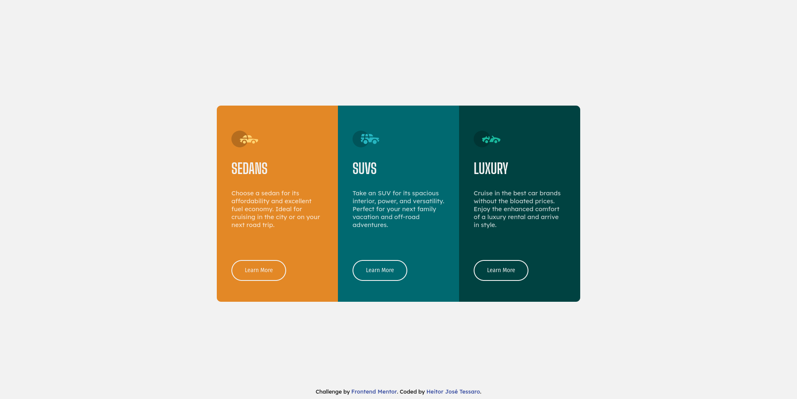

# Frontend Mentor - 3-column preview card component solution

This is a solution to the [3-column preview card component challenge on Frontend Mentor](https://www.frontendmentor.io/challenges/3column-preview-card-component-pH92eAR2-). Frontend Mentor challenges help you improve your coding skills by building realistic projects.

## Table of contents

- [Overview](#overview)
  - [The challenge](#the-challenge)
  - [Screenshot](#screenshot)
  - [Links](#links)
- [My process](#my-process)
  - [Built with](#built-with)
  - [What I learned](#what-i-learned)
  - [Continued development](#continued-development)
- [Author](#author)

## Overview

### The challenge

Users should be able to:

- View the optimal layout depending on their device's screen size
- See hover states for interactive elements

This solution aims to fulfil the requirement related to desktop users. A mobile solution will be developed in the future.

### Screenshot

The image below shows the final result of my attempt to replicate the project using just HTML and CSS.

### Links

- Solution URL: [My FrontEnd-Mentor Repository](https://github.com/heitortessaro/Frontend-Mentor)
- Live Site URL: [The live page on my portfolio](https://heitortessaro.github.io/projects/projects-frontend-mentor/3-column-preview-card-component/index.html)

## My process

### Built with

The creation of the project used just the basic concepts of CSS. New features, like CSS, was not covered by the Trybe course until this moment. Therefore, to test the acquired understanding, I chose to use just basic features from CSS.

- Semantic HTML5 markup
- CSS custom properties

### What I learned

The major drawback I faced in this project was related to the positioning of the card elements. Positioning them side by side without inner space was a challenge.

First, I tried to use the float attribute. However, the float attribute was not positioning the elements at the center horizontally and vertically. After some research, I decided to use the display: inline-block attribute. With this option, a space between the cards started to appear. To solve this issue, I set the font size to 0.

### Continued development

The future steps of this project are:

- Develop a mobile solution.
- Improve the positioning using flexbox or grid.

## Author

- Website - [Heitor José Tessaro](https://heitortessaro.github.io/)
- Frontend Mentor - [@heitortessaro](https://www.frontendmentor.io/profile/heitortessaro)
