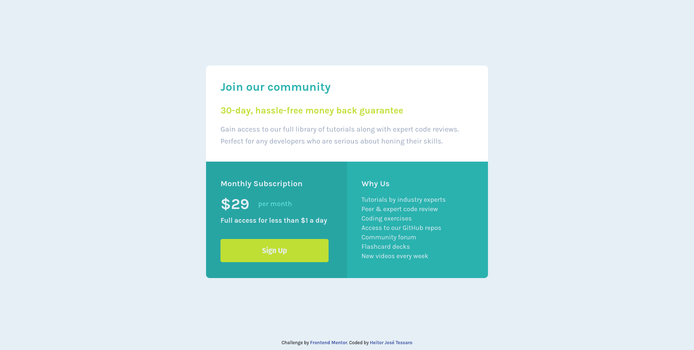

# Frontend Mentor - Single price grid component solution

This is a solution to the [Single price grid component challenge on Frontend Mentor](https://www.frontendmentor.io/challenges/single-price-grid-component-5ce41129d0ff452fec5abbbc). Frontend Mentor challenges help you improve your coding skills by building realistic projects.

## Table of contents

- [Overview](#overview)
  - [The challenge](#the-challenge)
  - [Screenshot](#screenshot)
  - [Links](#links)
- [My process](#my-process)
  - [Built with](#built-with)
  - [What I learned](#what-i-learned)
  - [Continued development](#continued-development)
- [Author](#author)

## Overview

### The challenge

Users should be able to:

- View the optimal layout for the component depending on their device's screen size
- See a hover state on desktop for the Sign Up call-to-action

This solution aims to fulfil the requirement related to desktop users. A mobile solution will be developed in the future.

### Screenshot

The image below shows the final result of my attempt to replicate the project using just HTML and CSS.

### Links

- Solution URL: [My FrontEnd-Mentor Repository](https://github.com/heitortessaro/Frontend-Mentor)
- Live Site URL: [The live page on my portfolio](https://heitortessaro.github.io/projects/projects-frontend-mentor/single-price-grid-component/index.html)

## My process

### Built with

The creation of the project used just the basic concepts of CSS. New features, like flexbox, was not covered by the Trybe course until this moment. Therefore, to test the acquired understanding, I chose to use just basic features from CSS.

- Semantic HTML5 markup
- CSS custom properties

### What I learned

Setting the same size for both bottom elements was the main challenge in this project. Positioning then was also an issue.

First, I used the vertical-align attribute to align both elements at the top. Then, I add all styles to the inside elements (spans, titles, buttons). After finishing styling the internal content, I set the left element high manually until it had the same size as the right element. However, I don't believe it is the best solution, but I did not find a better solution other than using a flexbox or a grid. Yet, as the objective was to use just the basic concepts of CSS, I avoided these solutions.

Additionally, I also faced problems related to an existing white space between the top and the bottom section. I used the transform/translate attribute to translate the bottom sections up manually to work around this problem.

### Continued development

he future steps of this project are:

- Develop a mobile solution.
- Improve the positioning using flexbox or grid.

## Author

- Website - [Heitor José Tessaro](https://heitortessaro.github.io/)
- Frontend Mentor - [@heitortessaro](https://www.frontendmentor.io/profile/heitortessaro)
